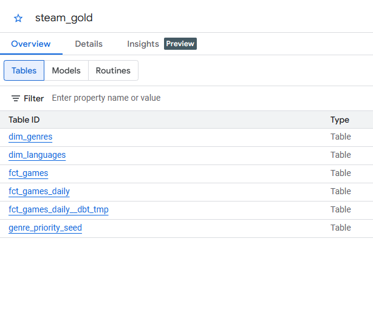
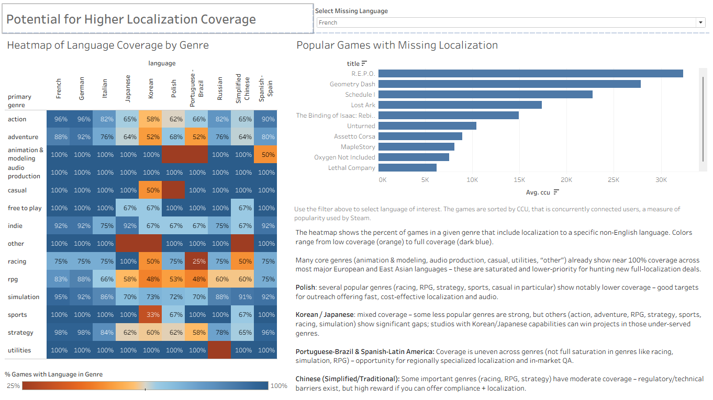
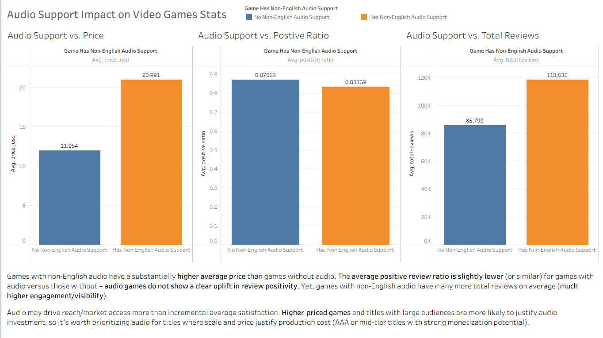

# Steam Video Games Localization Analytics

Capstone project for Data Engineering Zoomcamp.

This project builds an end-to-end data pipeline that collects Steam game metadata and SteamSpy popularity data, transforms it, and publishes analytics-ready tables in BigQuery.

## 1. Problem Statement

You are an analyst in a localization studio.

You want to understand current trends in game localization and identify possible ways to get new clients.

Main questions this project helps answer:

- Which languages are most common in popular Steam games?
- Which genres show the strongest localization activity?
- How do popularity signals (concurrent players, positive ratio, total number of reviews) relate to language coverage?
- Which game segments may represent opportunities for localization services?

## 2. Project Scope

This is a batch pipeline (daily schedule) with the following layers:

- Bronze: raw files from APIs (CSV)
- Silver: cleaned and standardized datasets (Parquet)
- Gold: analytics tables in BigQuery (dbt models)

The project currently ingests top 1000 appids (top most own titles) from SteamSpy for each run date.


## 3. Tech Stack

- Orchestration: Apache Airflow
- Containerization: Docker + Docker Compose
- Cloud Storage: Google Cloud Storage (GCS)
- Data Warehouse: BigQuery
- Transformations: dbt (`dbt-core`, `dbt-bigquery`)
- Data processing: Python + pandas + pyarrow

## 4. High-Level Architecture

1. Airflow DAG `steamspy_top1000_etl` runs daily.
2. Ingestion tasks pull:
	 - SteamSpy top games
	 - Steam Store details for those appids
3. Raw files are saved locally and uploaded to GCS Bronze.
4. Silver transformations clean and normalize the data to Parquet.
5. Silver Parquet files are uploaded to GCS.
6. dbt prepares external tables in BigQuery and builds Gold marts.
7. Gold tables are ready for BI tools (Tableau section below).

## 4.1 Airflow Orchestration Details (Beginner Friendly)

If you used Kestra in Zoomcamp, you can think about Airflow this way:

- Kestra Flow ~= Airflow DAG
- Kestra task ~= Airflow Operator task
- Schedule/triggers work in a similar idea: a workflow runs on a defined time plan

### What Airflow does in this project

Airflow is the workflow engine that decides:

- what should run,
- in which order,
- with retries if a task fails,
- and when the daily pipeline should start.

In this project, Airflow runs one main DAG called `steamspy_top1000_etl`.

### Airflow file structure in this repository

Main folders and files related to orchestration:

- `steam-project/docker-compose.yml`: starts Airflow services (`airflow-webserver`, `airflow-scheduler`) and Postgres metadata DB
- `steam-project/airflow/dags/steamspy_top1000_dag.py`: the DAG definition and task dependencies
- `steam-project/airflow/plugins/steam_etl/ingestion.py`: Python functions for API ingestion
- `steam-project/airflow/plugins/steam_etl/silver.py`: Python functions for silver and normalized transformations
- `steam-project/airflow/plugins/steam_etl/io_utils.py`: shared upload helper used by tasks
- `steam-project/logs/`: Airflow scheduler/task logs

### Main DAG configuration

The DAG in `steamspy_top1000_dag.py` is configured with:

- Daily schedule at `0 12 * * *` (12:00 UTC)
- `catchup=True` (Airflow can process past scheduled dates)
- `max_active_runs=1` (one DAG run at a time)
- retries enabled in `default_args` (`retries=1`, `retry_delay=5 minutes`)

*Airflow UI*


*Airflow DAG*


### Order of tasks in the DAG

The task flow is easier to read in stages:

1. Fetch SteamSpy top 1000 list to local CSV
2. In parallel after step 1:
	- upload SteamSpy CSV to GCS bronze
	- fetch Steam Store details to local CSV
3. Upload Steam Store details CSV to GCS bronze
4. Transform bronze -> silver:
	- Steam API silver transform
	- SteamSpy silver transform
5. Build normalized tables from Steam API silver data (`games`, `genres`, `languages`)
6. Upload silver parquet outputs to GCS:
	- Steam API silver
	- SteamSpy silver
	- normalized tables
7. Run dbt gold models after all required transforms are done

So the pipeline is not only linear. Some tasks run in parallel, then later join before dbt.

### How Airflow plugins work here

The DAG file stays focused on orchestration, while business logic is stored in plugin modules.

How it works:

- The DAG imports Python functions from `plugins/steam_etl/*`.
- Each `PythonOperator` calls one of these functions with `python_callable=...`.
- Data between tasks is shared with XCom (for example file names returned by one task and used by the next).

Why this design is useful:

- cleaner DAG file (dependencies are easy to read),
- logic is reusable and easier to test,
- less risk when changing one transformation step.

In short: the DAG is the "traffic controller", and plugin functions are the "workers" doing the real data processing.

## 5. Repository Structure

Key paths:

- `Makefile`: project automation commands for Docker, Airflow, dbt, and snapshot checks
- `steam-project/docker-compose.yml`: local Airflow + Postgres stack
- `steam-project/airflow/dags/steamspy_top1000_dag.py`: main orchestration DAG
- `steam-project/airflow/plugins/steam_etl/ingestion.py`: API ingestion logic
- `steam-project/airflow/plugins/steam_etl/silver.py`: Bronze -> Silver transformations
- `steam-project/dbt/`: dbt project for Gold layer
- `steam-project/dbt/models/staging/`: staging models
- `steam-project/dbt/models/marts/`: final analytics models
- `IMPLEMENTATION_NOTES.md`: deeper implementation notes

## 6. Prerequisites

Install:

- Docker Desktop (or Docker Engine + Compose plugin)
- Google Cloud project with BigQuery + GCS enabled

You also need:

- A GCS bucket
- A service account with access to BigQuery and the GCS bucket
- Service account key JSON file

## 7. Configuration

### 7.1 Environment variables

Create or update `steam-project/.env` with your own values.

Required keys:

- `AIRFLOW_UID`
- `AIRFLOW_GID`
- `FERNET_KEY`
- `SECRET_KEY`
- `GCP_BUCKET_NAME`
- `DBT_GOOGLE_PROJECT`
- `DBT_BIGQUERY_DATASET` (default: `steam_gold`)
- `DBT_BIGQUERY_STAGING_DATASET` (default: `steam_staging`)
- `DBT_BIGQUERY_SOURCE_DATASET` (default: `steam_external`)
- `STEAM_API_KEY` (optional for additional Steam Web API usage)

Important:

- Do not commit real secrets to git.
- Use your own `.env` values and your own GCP key.

### 7.2 GCP credentials

Place your service account key file at:

- `steam-project/gcp/credentials.json`

The containers use:

- `GOOGLE_APPLICATION_CREDENTIALS=/opt/airflow/gcp/credentials.json`

*GCS bucket structure example*


### 7.3 Airflow variable

The DAG expects Airflow Variable `gcp_bucket_name`.

Set it after containers are running:

```bash
docker compose -f steam-project/docker-compose.yml exec airflow-webserver \
	airflow variables set gcp_bucket_name <your-gcs-bucket>
```

## 8. How To Run (End-to-End)

From repository root:

```bash
cd steam-project
docker compose build
docker compose up -d
```

Initialize Airflow metadata DB:

```bash
docker compose exec airflow-webserver airflow db migrate
```

Create admin user:

```bash
docker compose exec airflow-webserver airflow users create \
	--username admin \
	--firstname Zoomcamp \
	--lastname User \
	--role Admin \
	--email admin@example.com \
	--password admin
```

Set required Airflow variable:

```bash
docker compose exec airflow-webserver airflow variables set gcp_bucket_name <your-gcs-bucket>
```

Open Airflow UI:

- URL: `http://localhost:8080`
- Default login from command above: `admin / admin`

Then:

1. Unpause DAG `steamspy_top1000_etl`
2. Trigger a run (or let schedule run)

## 8.1 Makefile Automation (Recommended)

The repository includes a top-level `Makefile` to simplify common commands.

Location:

- `Makefile` (project root)

Show available commands:

```bash
make help
```

Common workflow:

```bash
make up
make airflow-init
make set-bucket BUCKET=<your-gcs-bucket>
make unpause-dag
make trigger-dag
```

Useful operational targets:

- `make ps`
- `make logs`
- `make scheduler-logs`
- `make dag-list-runs`
- `make backfill DATE=YYYY-MM-DD`
- `make dbt-build`
- `make snapshot-latest`

Windows note:

- If `make` is not available in PowerShell, run via WSL:

```bash
wsl bash -lc "cd /mnt/c/Users/<user>/Projects/Steam_VideoGames && make help"
```

## 9. Running dbt Manually (Optional)

If you want to execute dbt manually inside the Airflow container:

```bash
docker compose exec airflow-webserver bash -lc "python /opt/airflow/dbt/scripts/prepare_bigquery_external_tables.py"
docker compose exec airflow-webserver bash -lc "dbt build --project-dir /opt/airflow/dbt --profiles-dir /opt/airflow/dbt --select +path:models/marts"
```

## 9.1 dbt Models Explained (What They Do and Why)

This project uses dbt in two layers:

- **Staging models**: clean and standardize raw external tables.
- **Mart models**: build analysis-ready fact and dimension tables.

### Staging models

- `stg_steam_api`
	- **What it does**: casts Steam API columns to correct types (`appid`, prices, date), keeps one latest row per appid.
	- **Why**: removes duplicates and type issues before joining with other sources.

- `stg_steamspy`
	- **What it does**: casts SteamSpy metrics to numeric types, keeps one latest row per appid.
	- **Why**: ensures popularity metrics are consistent and safe for aggregations.

- `stg_languages`
	- **What it does**: cleans normalized language rows, removes HTML fragments/noise, keeps `has_audio_support` as boolean.
	- **Why**: language analysis depends on clean, one-language-per-row data.

### Mart models

- `fct_games`
	- **What it does**: main game-level fact table by joining staged Steam API and SteamSpy data.
	- **Why**: provides one central table for pricing, engagement, and review KPIs.

- `fct_games_daily` (incremental)
	- **What it does**: stores per-day snapshots (`appid`, `snapshot_date`) and merges only new/changed rows.
	- **Why**: supports trend analysis over time and keeps daily refresh efficient.

- `dim_genres`
	- **What it does**: explodes comma-separated genres into one row per `appid + genre`.
	- **Why**: makes genre filtering/grouping simple in BI tools.

- `dim_languages`
	- **What it does**: one row per `appid + language`, with audio support flag and stable key.
	- **Why**: enables clean language coverage analysis, including audio vs non-audio support.

## 9.2 Silver Layer Transformations (What and Why)

The silver layer is built in Airflow plugin code (`steam-project/airflow/plugins/steam_etl/silver.py`) before dbt runs.

Main transformations and reasons:

- **Schema safety checks**
	- Missing expected columns are created when needed.
	- **Why**: avoids task failure when source files have small schema differences.

- **Date cleaning (`release_date`)**
	- Converts to datetime and creates `release_date_missing` flag.
	- **Why**: keeps date logic reliable while preserving information about missing values.

- **Price cleaning (`price_usd`, `price_pln`)**
	- Removes currency symbols/text, normalizes decimal separators, converts to numbers.
	- **Why**: allows valid numeric comparisons and aggregations in SQL/BI.

- **Language code cleanup**
	- Replaces internal Steam tokens (for example `#lang_*`) with human-readable names.
	- **Why**: improves readability and avoids noisy categories in analysis.

- **Deduplication by `appid`**
	- Keeps one row per app in silver outputs.
	- **Why**: prevents double-counting in downstream models.

- **SteamSpy value cleanup**
	- Maps owners ranges to categories and clips negative metric values to 0.
	- **Why**: improves consistency and protects KPI calculations from invalid values.

- **Normalization to separate parquet tables**
	- Builds `games`, `genres`, and `languages` tables from silver API data.
	- Splits comma-separated fields and explodes them to row-level format.
	- Filters out `Free To Play` from genres as a business model label.
	- Extracts audio-support markers from language text.
	- **Why**: creates analysis-ready tables that are easier to query and join.

- **Incremental metadata tracking**
	- Saves last processed date in `silver_metadata.txt` for each silver/normalized table.
	- **Why**: supports safe reruns and avoids unnecessary reprocessing.

## 10. Expected Outputs

### Bronze (local + GCS)

- SteamSpy raw CSV (top 1000)
- Steam Store details CSV

### Silver (local + GCS)

- `steam_api_silver_<date>.parquet`
- `steamspy_silver_<date>.parquet`
- `games_<date>.parquet`
- `genres_<date>.parquet`
- `languages_<date>.parquet`

### Gold (BigQuery via dbt)

Marts include:

- `fct_games`
- `fct_games_daily` (incremental, partitioned by date, clustered by appid)
- `dim_genres`
- `dim_languages`

*BigQuery dataset example*


## 11. Data Quality and Reliability Notes

- Silver layer includes cleaning, typing, and normalization logic.
- Incremental behavior is tracked with metadata in `silver_metadata.txt`.
- The pipeline uses task retries and file-based logs in Airflow.
- Steam Store requests are throttled in ingestion code to reduce risk of temporary blocking.

## 12. Tableau Dashboard

You will find my dashboard on Tableau Public: https://public.tableau.com/shared/NM8C8SWWW?:display_count=n&:origin=viz_share_link

If the Tableau Public link is temporarily unavailable, preview screenshots are included below:




PowerPoint version (local fallback):
[Deep Dive Video Game Localization Trends on Steam.pptx](steam-project/dashboard/Deep%20Dive%20Video%20Game%20Localization%20Trends%20on%20Steam.pptx)

It includes:

- Titles with the highest number of languages
- Top languages with and without non-English audio support
- Audio Support Impact on Video Games Stats
- Potential for Higher Localization Coverage (heatmap of language coverage by genre, popular games with missing localization)
- Language coverage vs. performance

In case of service outage you will find the Power Point version of the dashboard in steam-project/dashboard.

Data source for Tableau:

- BigQuery Gold tables (`steam_gold` dataset), primarily `fct_games_daily`, `fct_games`, `dim_genres`, `dim_languages`

## 13. Reproducibility Checklist

Before sharing your run with other participants, verify:

1. `docker compose ps` shows healthy containers
2. Airflow DAG `steamspy_top1000_etl` finishes successfully
3. New files appear in GCS Bronze and Silver paths
4. dbt models complete without errors
5. BigQuery dataset `steam_gold` contains updated tables

## 14. Known Limitations and Next Steps

- No Terraform/IaC yet (infrastructure setup is manual)

